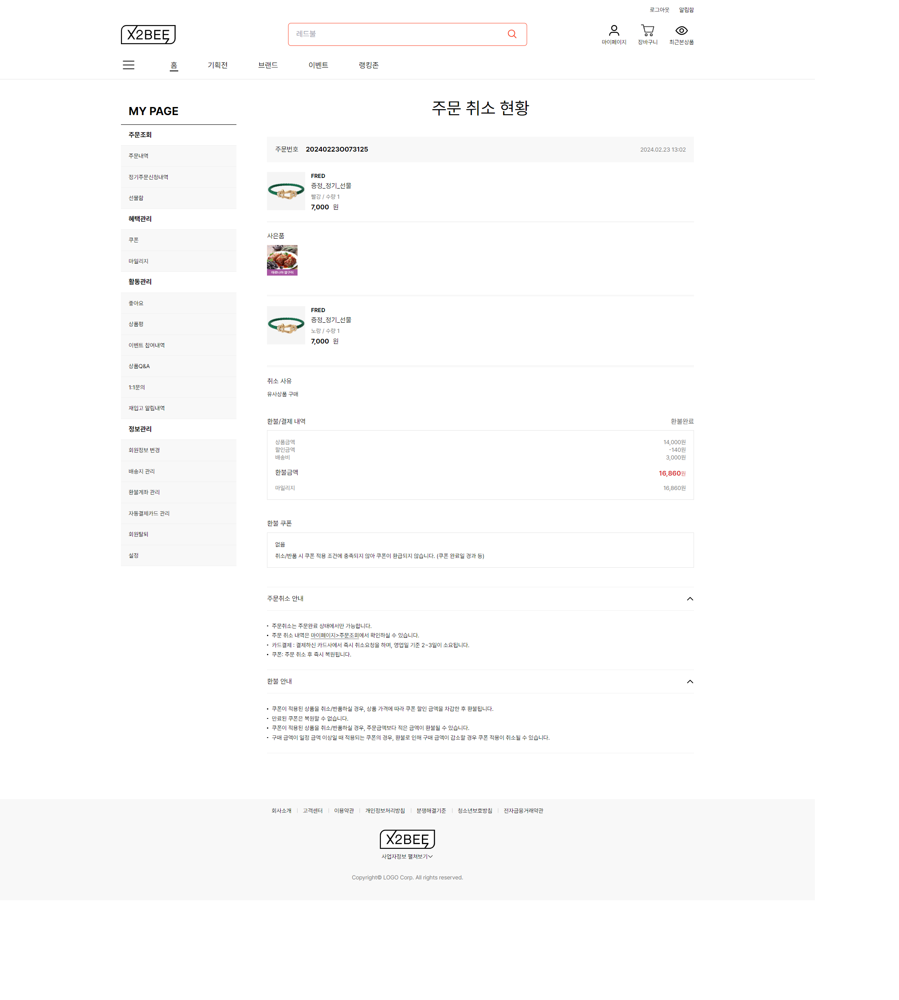
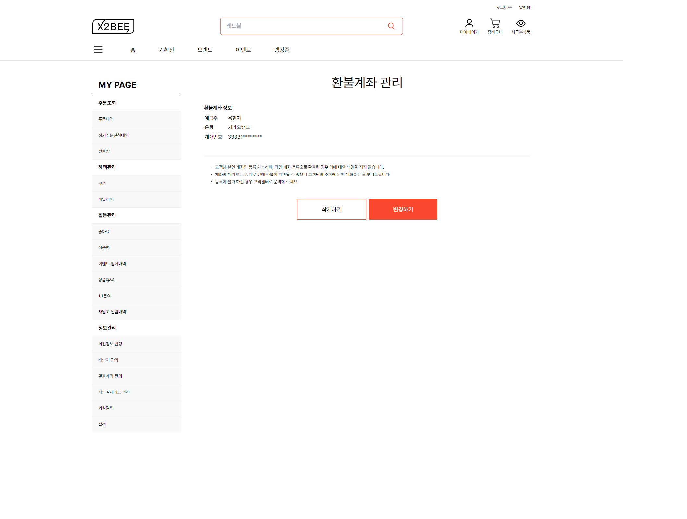

#### 1. 플래티어 x2bee 이커머스 solution 프로젝트

[사진]
- 
- 
- 
- 
- 

[기간]
- 2023.09 ~ 진행중

[역할]
- 클레임 담당: 취소 상세, 교환 상세, 보낸 선물함 상세, 받은 선물함 상세 등을 담당하였습니다.
- 회원 담당: 아이디 찾기, 환불계좌 관리, 환불계좌 변경 등을 담당하였습니다.
- 프로모션 담당: 마일리지 지급 관리, 마일리지 집계 현황 등을 담당하였습니다.

[성과]
- 마이그레이션: vue.js(nuxt) -> react.js(next)로 진행하였습니다.
- uml 도입: PlantUML tool을 이용하여 프로젝트에 sequence diagram으로 소통하는 방식을 도입하였습니다.
  또한, 코드로 다이어그램을 작성하여 개발자들과 관리자들이 쉽게 수정 및 보완 할 수 있게 하였습니다.
- swagger 및 산출물 작성: swagger 작성 및 사용자 메뉴얼, 프로그램 목록, 정책서 등의 산출물을 작성하여 글로 하는 의사소통을 향상시켰습니다.
- 개발일정 준수율: 개발완료일 준수건 / 개발완료건, 89/89을 유지하여 프로젝트를 100% 성공적으로 완료하였습니다.
- 배포당 결함 수: 테스트 코드를 적극적으로 활용하여 배포당 결함 수를 최소화하였고, 결함 건수/배포 건수는 3/21로 유지되었습니다.
- 장애 해결률: 공식문서, CHAT-GPT, 페어 프로그래밍, 소나 큐브 등을 적극적으로 활용하여 장애 해결률을 100%로 높여 개발 안정성을 향상시켰습니다.
- 팀 교육: 주기적으로 팀원에게 교육을 진행하여 TDD, 객체지향, KPI 산출, 리팩토링 등의 전반적인 개발 스킬을 향상시켰습니다.

[사용 기술]
- FRONT: Javascript, typescript, React, next.js, zustand
- BACK: Java, SpringBoot
- DB: PostgreSQL